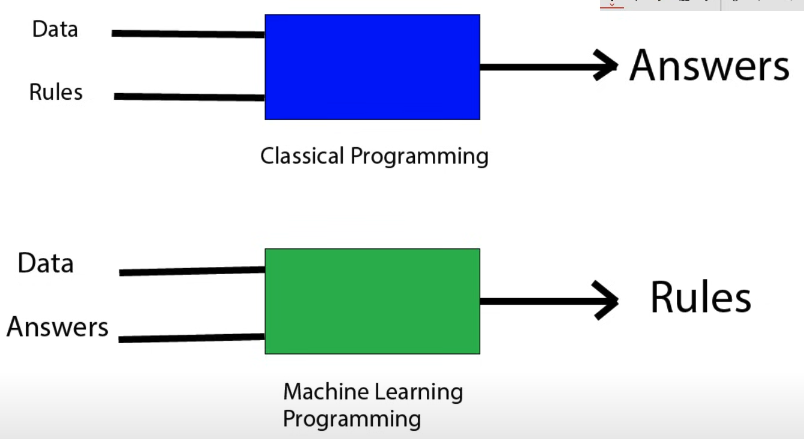

# general

## AI = Artificial Intelligence

- a machine does something that we would consider intelligent if a human did it
- can be simple or complex
- can be a single task or multiple tasks
- also playing a game just by following a given set of rules is AI
- input > rule > output

## ML = Machine Learning

- a machine learns from data / figures
- the machine learns to do something without being explicitly programmed to do it = figures out the rules by itself
- aims for best possible outcome to get the answer right (therefore not all the time correct / same answer)
- goal: model with high accuracy
- can be supervised or unsupervised
- can be reinforcement learning
- can be deep learning

## DL = Deep Learning / Neural Networks

- ML that uses a layered representation of data
- input for layer 1 > output > input for layer 2 > output > input for layer n > output
